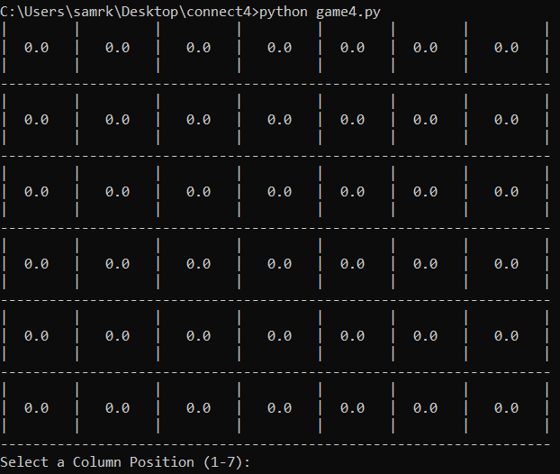
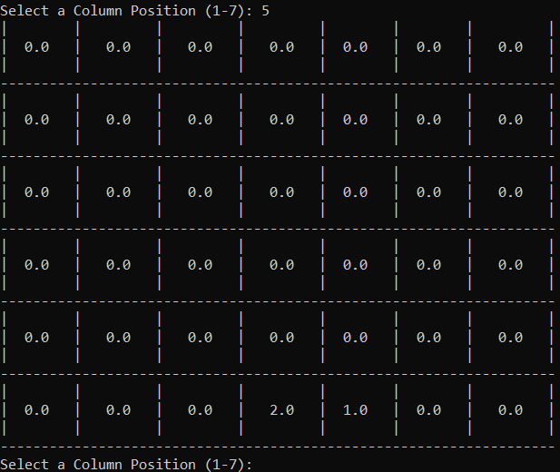
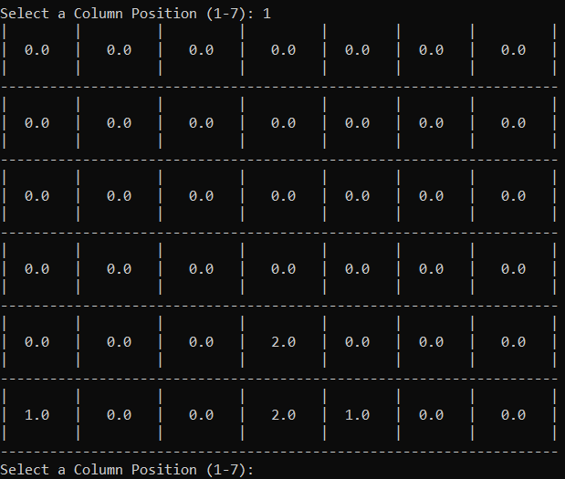
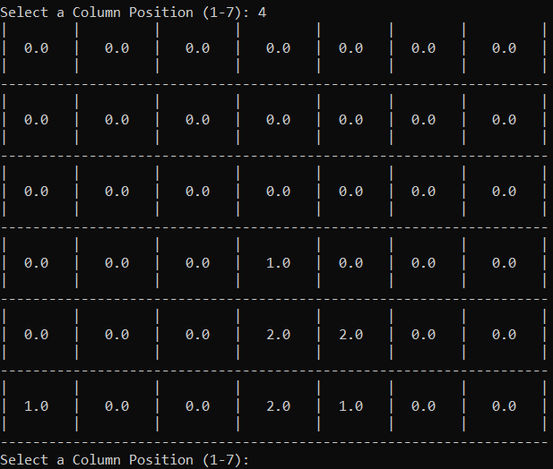
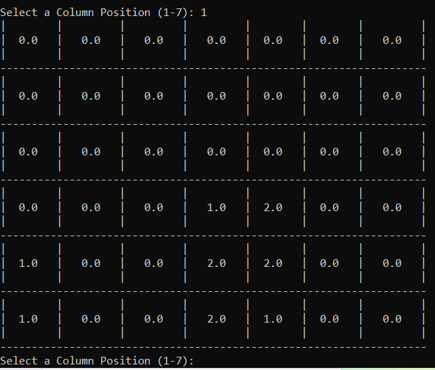
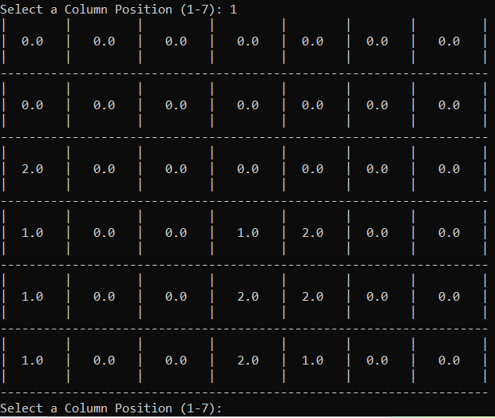
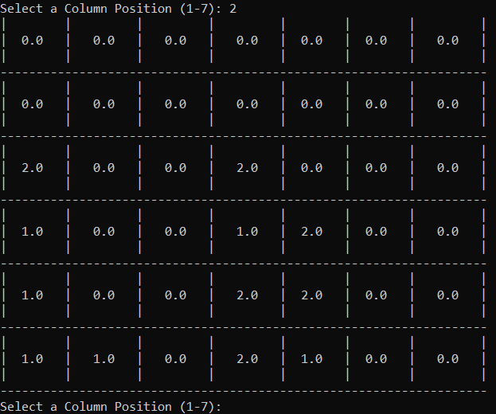
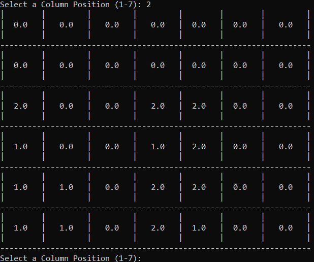
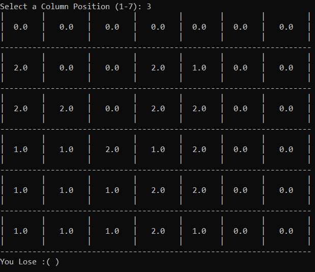

# Connect4-Game-Simple-AI
A python console connect 4 game where the opponent is a simple AI that makes choices based on weighted decisions.
Currently, the game just runs on the python console with 0's, 1's, and 2's. 
0's are empty spaces, 1's are user spaces, 2's are computer spaces.
Admittedly, it is sore to the eyes so I am currently learning pygame to make the play more user friendly, that update may be out soon.

## Brief Example of a Game:

### This goes on until I eventually lose

